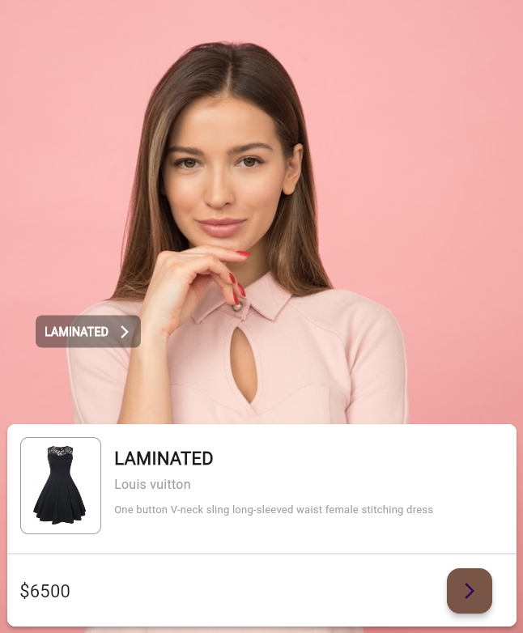

# Flutter Design Application

This project is a design application built using Flutter. The app demonstrates various Flutter components and layout structures.

## Features

- **Stack Widget**: Allows for overlaying multiple widgets on top of each other to create complex visual designs and layered UI elements.
- **Navigator**: Enables smooth navigation between different screens or pages, providing an interactive user experience.
- **Container**: A rectangular visual element that can be customized with color, shape, size, and padding.
- **Column & Row**: Used to create flexible layouts that arrange children widgets vertically or horizontally.
- **Material Widgets**: Follows Material Design guidelines to provide a consistent and intuitive user interface across different platforms.

## Screenshots

| Tab picture 1 | Tab picture 2 | Tab picture3 |Homepage |
|---|---|---|---|
|  |  |  |  |

## Installation

To run this project on your local machine, follow these steps:

### Prerequisites

- Flutter SDK: [Install Flutter](https://flutter.dev/docs/get-started/install)
- Dart: Comes bundled with the Flutter SDK
- IDE: [Visual Studio Code](https://code.visualstudio.com/) or [Android Studio](https://developer.android.com/studio)

### Steps

1. **Clone the repository**:
   ```bash
   git clone https://github.com/yourusername/flutter-design-app.git
   cd flutter-design-app
   
2. **Install dependencies**:
   ```bash
   flutter pub get

2. **Run the application**:
   ```bash
   flutter run

## Contributing

If you'd like to contribute to this project, please fork the repository and use a feature branch. Pull requests are welcome.

## Contact

ali.altin319@gmail.com
